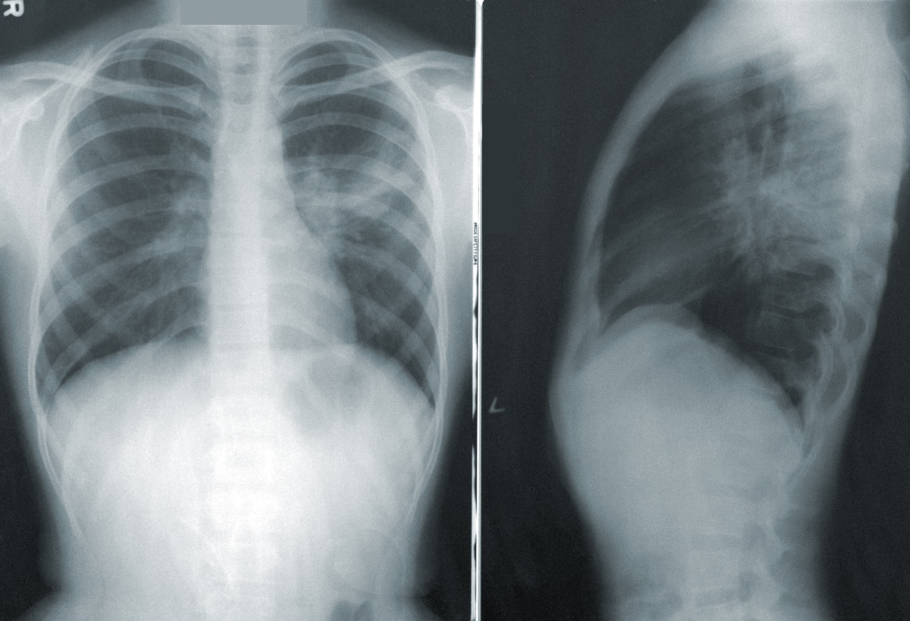

# NIH Chest X-rays Classification

# Capstone Project III
1.	[Introduction](#1-introduction)
2.	[Data Sources](#2-data-sources)
3.  [EDA](#3-eda)
4.  [Modeling](#4-modeling)
5.  [Reports](#5-reports)

## 1. Introduction
Chest X-ray exams are one of the most frequent and cost-effective medical imaging examinations available. As one of the most ubiquitous diagnostic imaging tests in medical practice, chest radiography requires timely reporting of potential findings and diagnosis of diseases in the images. Automated, fast, and reliable detection of diseases based on chest radiography is a critical step in radiology workflow. 

Therefore, we will be developing a transfer learning model for differentiating between normal and abnormal frontal chest radiographs, in order to help alert radiologists and clinicians of potential abnormal findings as a means of work list triaging and reporting prioritization. 

### Problem Statement

How to reduce 70% of radiologists/clinicians’ workload by building a deep learning model to differentiate between normal and abnormal frontal chest radiographs with higher accuracy (at least 80% accurate) than previous models by the end of 2021?

## 2. Data Sources
[NIH Chest X-rays TFRecords](https://www.kaggle.com/nickuzmenkov/nih-chest-xrays-tfrecords) - This is a non-official TFRecord version of NIH Chest X-rays dataset on Kaggle. The initial DataFrame has been preprocessed to format more suitable for CNN training purposes (see preprocessed_data.csv file). Only images (downscaled to 600x600 and encoded as 1-channel jpegs) and corresponding diagnosis (15 categories) were left with all additional patient information excluded (e.g. age, sex, etc.). All 112,120 samples were kept (no filtration, grouping, or removing were performed).

This dataset includes:
* Preprocessed DataFrame: preprocessed_data.csv
* TFRecords: 256 serialized .tfrec files under the /data directory with name format f'{number}-{number_or_samples}'

## 3. EDA
### General

  

  

### Findings (14 Classes)

  

  

  

### Chest X-rays 

  

### Correlation

  

For more details: 
[Exploratory Data Analysis](https://github.com/tvo10/NIH-chest-x-rays-classification/blob/main/nih_chest_x-rays_classification_data_wrangling_eda.ipynb)

## 4. Modeling
We will build our base model by using transfer learning. Transfer learning is a great way to reap the benefits of a well-trained model without having the train the model ourselves. We got 0.8388 as the highest accuracy score when we are fine-tuning the model using the train and validation datasets. Based on our test dataset, we got 0.82 for the accuracy score, which is already accomplished our objective. Even though the model still needs to be improved, we decided to temporarily accept 0.82 accuracy score as an achievement for this notebook as this score is higher than several models on Kaggle.

Using our model, let us visualize some of our predictions, whether the chest x-ray images are 
normal or abnormal using our testing dataset.

For more details: 
[Modeling](https://github.com/tvo10/NIH-chest-x-rays-classification/blob/main/nih_chest_x-rays_deep_learning.ipynb)

## 5. Reports
1. [Capstone Project III Final Report](https://github.com/tvo10/NIH-chest-x-rays-classification/blob/main/NIH_chest_x-rays_classification_report.pdf)
2. [Capstone Project III Final Presentation](https://docs.google.com/presentation/d/1piWjlLZJo8wi1TAl2B5zUwwfR2qS8iempHcPylS3sJQ/edit?usp=sharing)
